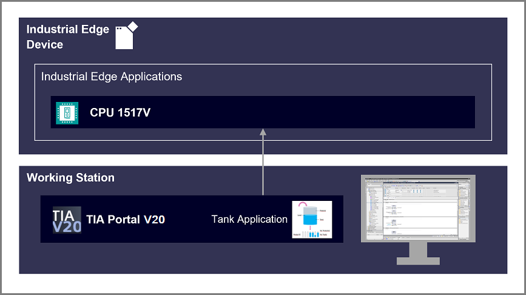

#  Virtual PLC CPU 1517V Getting Started

- [vPLC Getting Started](#-vplc-getting-started)
  - [Description](#description)
    - [Overview](#overview)
    - [General Task](#general-task)
  - [Requirements](#requirements)
    - [Prerequisites](#prerequisites)
    - [Used components](#used-components)
    - [TIA Project](#tia-project)
  - [Installation](#installation)
  - [Usage](#usage)
  - [Documentation](#documentation)
  - [Contribution](#contribution)
  - [License and Legal Information](#license-and-legal-information)
    
## Description

### Overview

This getting started describes how to set up the Industrial Edge Virtual Device (IEVD) for purposes of 1517V application and downloading a TIA Portal project to the Virtual PLC.

### General Task

In this getting started guide, the hardware of the Industrial Edge Virtual Device (IEVD) is set up for the installation of the 1517V CPU application. Next, the corresponding PLC is configured in the Tank Application TIA Portal project. The 1517V is identified by its MAC address from the list, and the project is downloaded into it. Finally, the online mode of the 1517V is tested, and its web server is accessed.

## Requirements

### Prerequisites

- Access to an Industrial Edge Management System (IEM)
- Onboarded Industrial Edge Virtual Device with firmware version 1.21 or later on IEM
- CPU 1517V App available in the catalog of the IEM
- Access to working station with TIA Portal V20 installed
- The IEVD is reachable from working station
- ESXi Host Client V8.0.0

### Used components

- Industrial Edge Management Pro (IEM) V1.11.17
- Industrial Edge Virtual Device (IEVD) (firmware version: V1.21.1-1-a)
- CPU 1517V V2.0.0-1.0
- TIA Portal V20
- Web browser (Google Chrome)

### TIA Project

The used TIA Portal project can be found in the [miscellenous repository](https://github.com/industrial-edge/miscellaneous/tree/main/tank%20application). This project is also used for several further application examples.

## Installation

- Configure HW of IEVD VM
- Configure 1517V NIC isolation on IED
- Install 1517V application
- Configure TIA Portal project
- Download TIA Portal project into 1517V

You can find the further information about the following steps in the [Installation](docs/Installation.md).

## Usage

After completing the installation steps as described in the [Installation](docs/Installation.md) chapter, the Tank Application TIA Portal project will be running on CPU 1517V on the IEVD. For information on the licensing of the CPU 1517V, please refer to the [Licensing](/docs/License_handling.md) chapter.

## Documentation

You can find further documentation and help in the following links

- [S7-1500 Virtual Controller CPU 1517V function manual](https://support.industry.siemens.com/cs/document/109825448/s7-1500-virtual-controller-cpu-1517v-function-manual?dti=0&dl=en&lc=de-WW)
- [Industrial Edge Hub](https://iehub.eu1.edge.siemens.cloud/#/documentation)
- [Industrial Edge Forum](https://www.siemens.com/industrial-edge-forum)
- [Industrial Edge Documentation](https://docs.industrial-edge.siemens.cloud/)
- [Industrial Edge landing page](https://new.siemens.com/global/en/products/automation/topic-areas/industrial-edge/simatic-edge.html)
- [Industrial Edge GitHub page](https://github.com/industrial-edge)

## Contribution

Thank you for your interest in contributing. Anybody is free to report bugs, unclear documentation, and other problems regarding this repository in the Issues section. Additionally everybody is free to propose any changes to this repository using Pull Requests.

If you haven't previously signed the [Siemens Contributor License Agreement](https://cla-assistant.io/industrial-edge/) (CLA), the system will automatically prompt you to do so when you submit your Pull Request. This can be conveniently done through the CLA Assistant's online platform.
Once the CLA is signed, your Pull Request will automatically be cleared and made ready for merging if all other test stages succeed.

## License and Legal Information

Please read the [Legal information](LICENSE.txt).
