# 1517V Getting Started: Installation

- [1517V Getting Started: Installation](#1517v-getting-started-installation)
  - [Overview of example environment](#overview-of-example-environment)
  - [Configure the ESXi settings](#configure-the-esxi-settings)
    - [Configure power management](#configure-power-management)
    - [Configure PCI passthrough](#configure-pci-passthrough)
  - [Configure the ESXi IEVD settings](#configure-the-esxi-ievd-settings)
  - [Configure 1517V NIC isolation on IEVD](#configure-1517v-nic-isolation-on-ievd)
  - [Install 1517V application](#install-1517v-application)
  - [Configure TIA Portal project](#configure-tia-portal-project)
      - [Option 1: Change device](#option-1-change-device)
      - [Option 2: Start from scratch](#option-2-start-from-scratch)
      - [Networking configuration](#networking-configuration)
  - [Download TIA Portal project into 1517V](#download-tia-portal-project-into-1517v)

## Overview of example environment

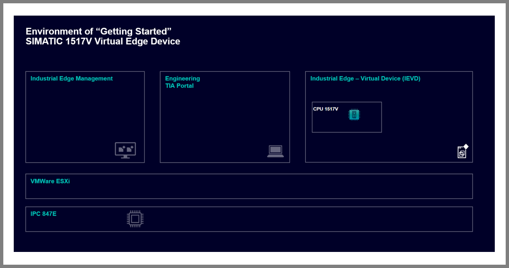

> **Important**
>
> To be able to make the changes to ESXI and the VM described in the next sections, you need to turn off the IEVD VM.
>

## Configure the ESXi settings

The settings described in the following subsections need to be done in the ESXi environment to ensure the best possible performance.

More information can be found in [this manual](https://support.industry.siemens.com/cs/mdm/109825448?c=173600339979&lc=en-us) which is used as reference for this section.

### Configure power management

To achieve maximum performance and improve stability and reliability, change the power management policy to "High performance." Go to the Navigator in your ESXi Host Client UI -> Host -> Manage -> open the Hardware tab. In this tab click on "Change policy", select "High performance" and click on OK.

### Configure PCI passthrough

To meet the realtime requirements, the 1517V must be assigned to a physical network card using PCI passthrough. This feature needs to be enabled on the designated card and then assigned to the 1517V PLC. For more details on how PCI passthrough works, please refer to the provided [information](https://techdocs.broadcom.com/us/en/vmware-sde/edge-compute/vmware-edge-compute-stack/3-0/enterprise-edge-reference-architecture-guide/design-considerations-for-industry-use-cases/gpu-deployment-at-the-edge/gpu-device-in-pci-passthrough.html).

In your ESXi Host Client UI go to the Navigator -> Host -> Manage and open your hardware tab. In this tab select your network card to use for the new 1517V. And click on "Toggle passthrough".

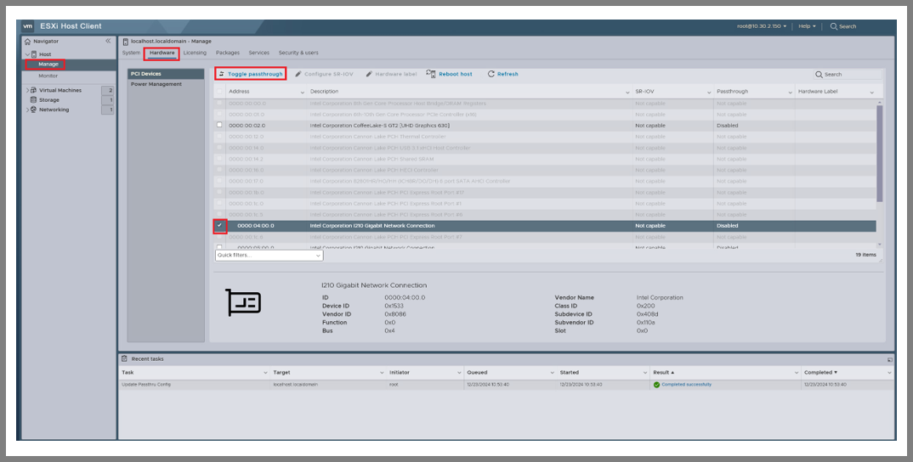

## Configure the ESXi IEVD settings

This chapter deals with the configuration of the IEVD. These changes must be made whenever a new IEVD is used. Make sure, that the IEVD has 2 CPU Cores to ensure the realtime behavior of the 1517V and 6 GB of RAM. The reservation of computation power in MHz can be calculated using the following formula:

> Reservation (MHz) = Number of CPU cores of IEVD VM * Frequency of the host CPU (MHz)

Set also the limit to "Unlimited" for save measure.

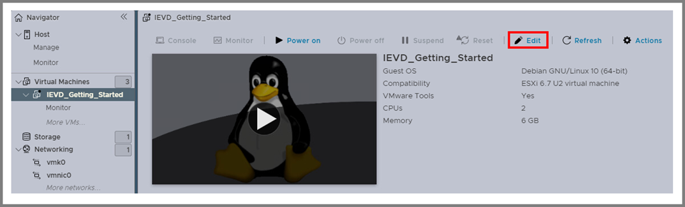

Change to the Memory tab and check the check box "Reserve all guest memory (All blocked)". Finally, click on Save.

Proceed by setting up the latency sensitivity.

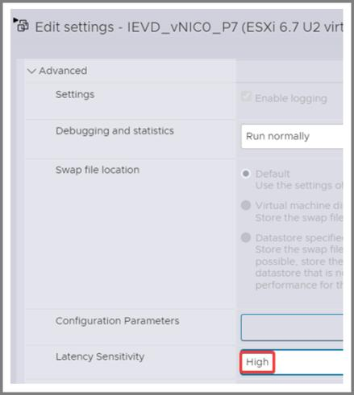

Finally, add the network card to your VM as a PCI device.

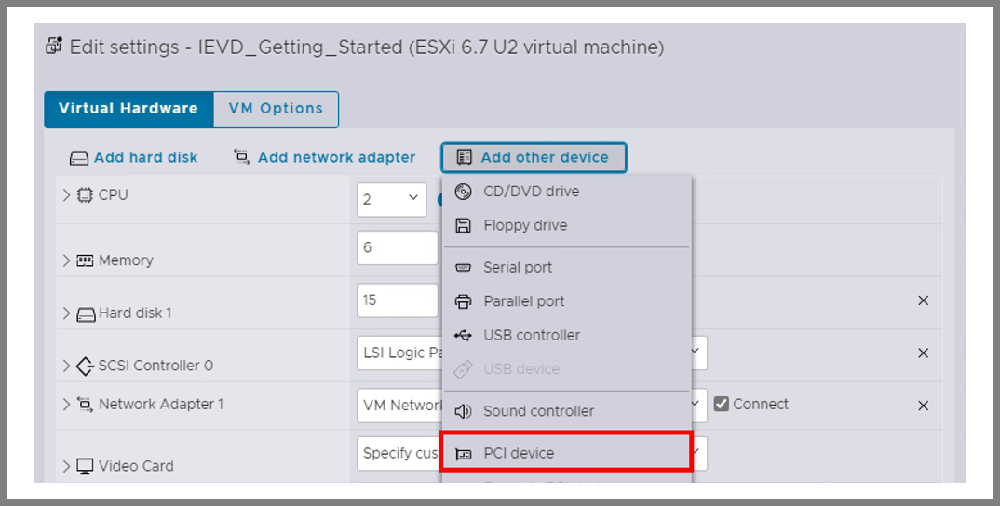

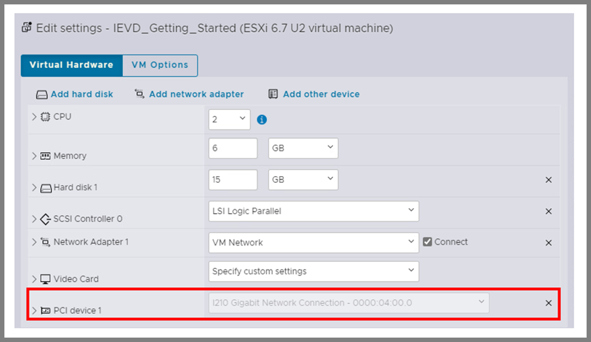

## Configure 1517V NIC isolation on IEVD

> **Note**
>
> NIC is abbreviation of Network Interface Controller.
>

NIC isolation enables Industrial Edge applications to directly access a network interface within the application container. To set this up, open your IEVD UI and go to Settings -> Connectivity -> LAN Network. Verify which NIC is assigned to the 1517V and take note of its name (in this case, it's "ens192").

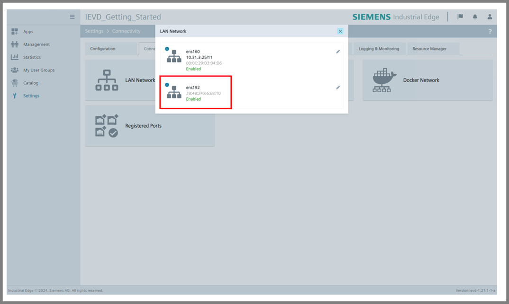

Then, after closing the LAN Network window change to Resource Manager and see that there isn't any NIC under Enabled Resources -> siemens.com/isolated_network. In order to configure the isolated NIC, click on "+" on the right side.

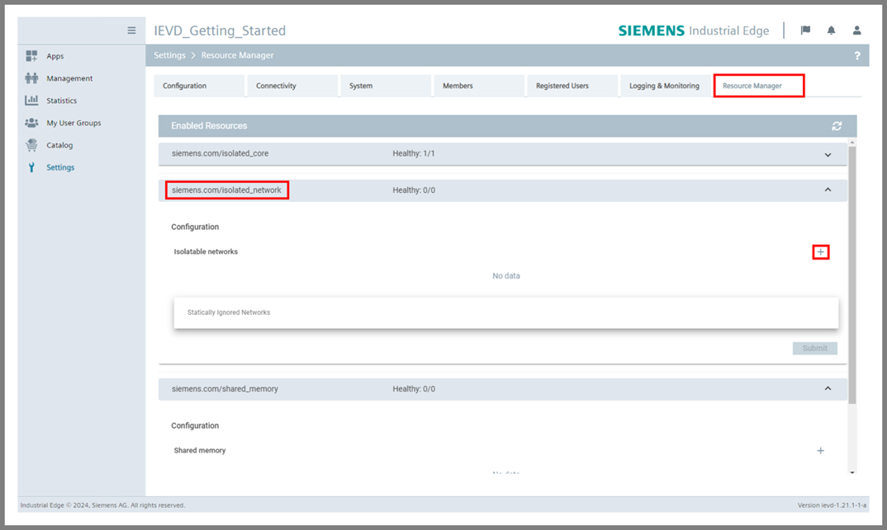

Proceed by writing down the noted NIC name ("ens192" in this case). Moreover, add Annotation of this NIC isolation by clicking on another "+" on right side. Write down the name of the isolated NIC "1517V". Finally, click on Submit.

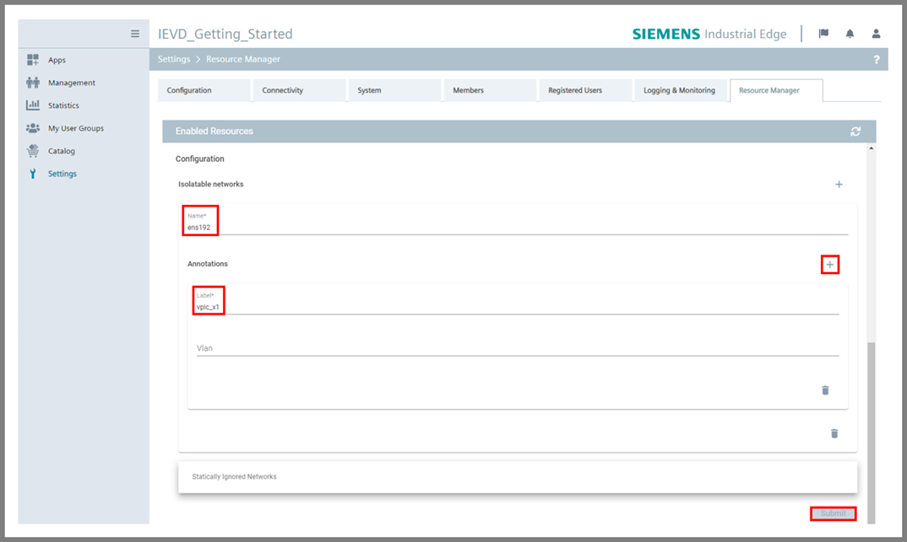

> **Note**
>
> After isolating the 1517V NIC, the isolated NIC should disappear from the settings.
>

## Install 1517V application

In order to run the 1517V part of this getting started as a whole, the 1517V application should be installed on your IED:

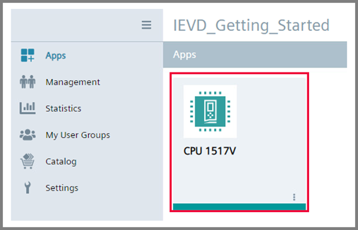

> **Important**
>
> If you use IEVD and cannot install the CPU 1517V application, then double check if you have the required HW configuration (at least 2 CPU cores and 6 GB of Memory) and followed to steps in the previous chapter [Configure 1517V NIC isolation on IEVD](#configure-1517v-nic-isolation-on-ievd) correctly.
>

## Configure TIA Portal project

#### Option 1: Change device

Download the TIA Portal project from [miscellenous repository](https://github.com/industrial-edge/miscellaneous/tree/main/tank%20application). Open it in TIA Portal V20 and let it upgrade to latest version. Then, right click on PLC and change device to "CPU 1517V-1 PN" (article number "6ES7 587-1AP00-0AB0").

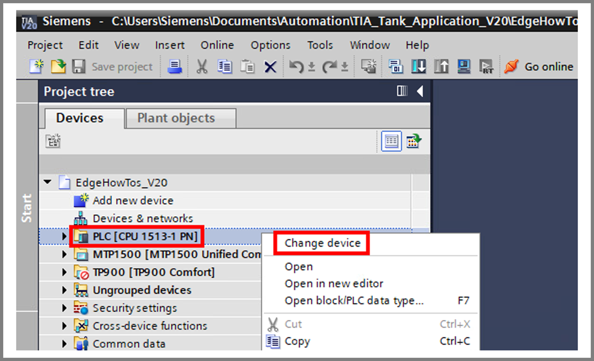

#### Option 2: Start from scratch

In case if you configure the 1517V from scratch, click on Add new device and in HW catalog navigate to Controllers -> SIMATIC S7-1500 -> CPU. Select the "CPU 1517V-1 PN" with article number "6ES 587-1AP00-0AB0" and click on OK.

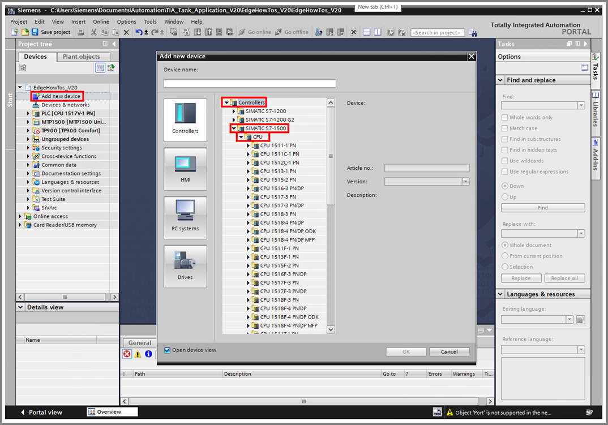

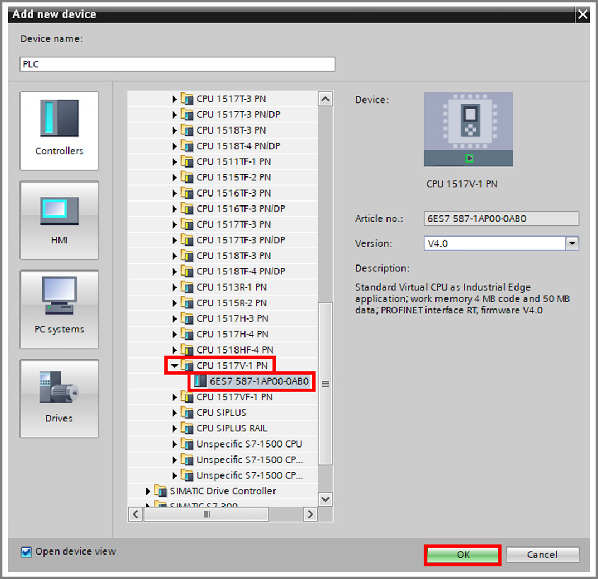

#### Networking configuration

Then, configure the desire IP address of your PLC in its Properties (Devices & Networks -> double click on CPU of PLC) -> PROFINET Interface [X1].

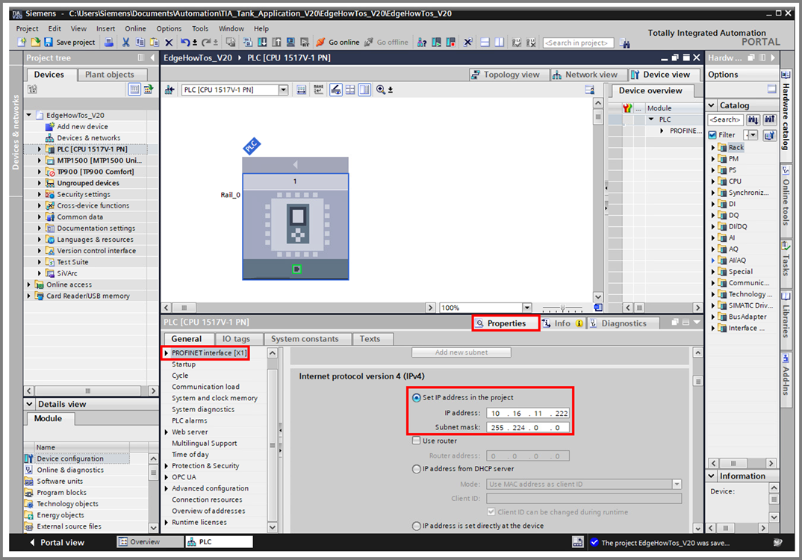

> **Important**
>
> If the vPLC should be accessible from different network over router, configure also router in here. So far (in version CPU1517V V2.0.1, May 2025) it is only option to configure router on vPLC.
>

## Download TIA Portal project into 1517V

First of all, go to your IED UI, open the UI of CPU 1517V application, assign a free IP address, Subnet mask and confirm with "Set IP". You will need this address to identify the PLC in TIA Portal during the initial download. Although the IP address hasn't been assigned yet, you can assign it within the UI before downloading the TIA project for the first time.

In TIA Portal select the PLC and press the button for downloading the project into PLC.

In the next window select the PG/PC Interface where IEVD is connected and proceed by selecting "Show all compatible devices" as a target device. Then, click on Start search. From the list, choose the accessible device with the same IP address as specified in the CPU 1517V application. Alternatively, you can select the device by its MAC address, which is also mentioned in the IEVD UI. Assigning an IP address is unnecessary at this stage, as TIA will assign one after the first download.

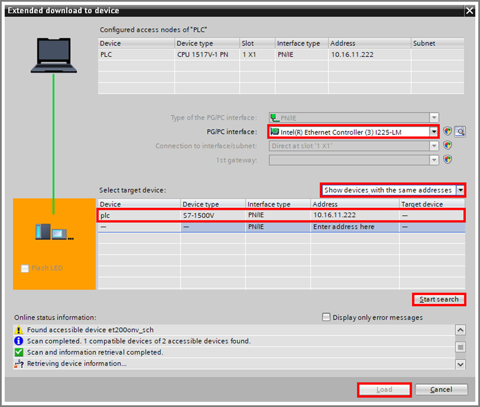

Finally, click on Load. After loading, you can run the PLC. Then, you can go online, check if the status of all components is OK.

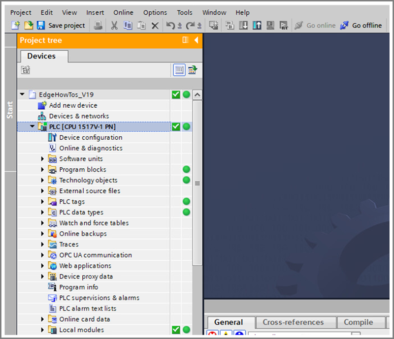

If the PLC's Web server is activated (Properties -> Web server -> General -> "Activate web server on this module" check box is checked) and access to it via PROFINET Interface [X1] is enabled in the Properties of PLC (Properties -> PROFINET Interface [X1] -> Web server access -> "Enable Web server via IP address of this interface" check box is checked), then the Web server should be accessible in the browser.

Finally, the changing values of the variables can be checked.

To learn how to assign a license to the Industrial Edge Hub and verify a license, please refer to the [License](/docs/License_handling.md) chapter.
